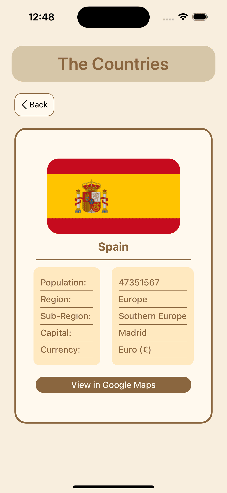
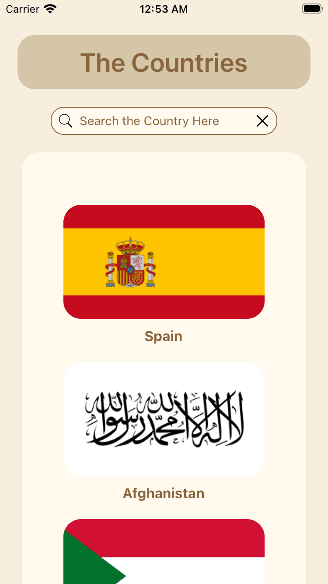
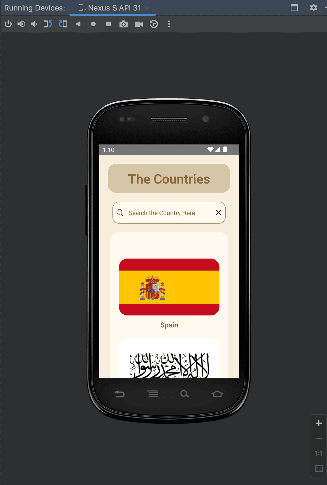
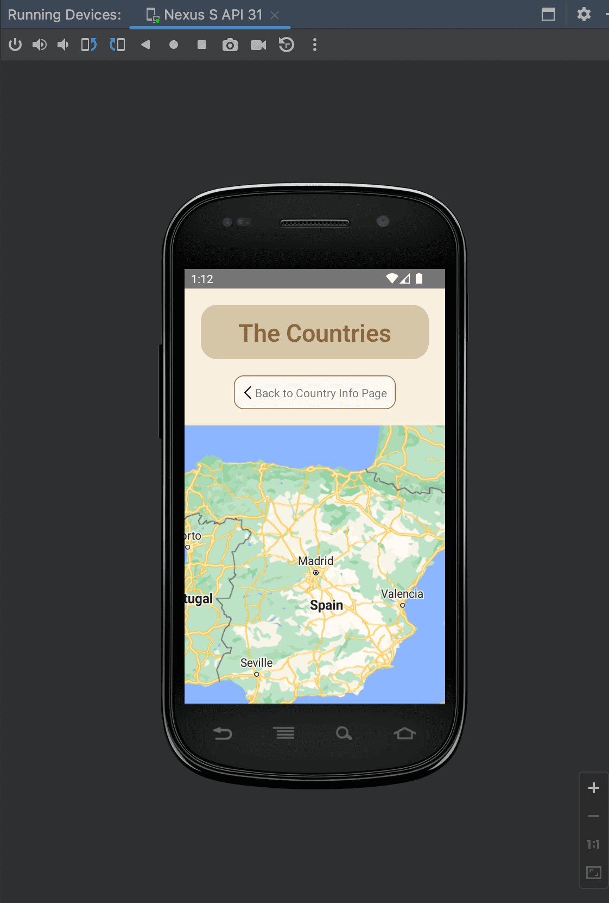

# rest-countries-react-native-app

To run the project locally

1. git clone the project repo

2. yarn install

3. cd ios && pod install && cd ..

4. yarn react-native run-ios (to launch app on ios simulator) or yarn react-native run-android (to launch app on android emulator)

5. yarn start (to start the metro)

 

<Strong>
Project Description
</Strong>

1. The first page has a search bar which display list of countries according to the keyword searched
2. After clicking on the selected country, the next page shows the selected country details
3. All the countries data is obtain from https://restcountries.com/ API

 

## Screenshots

 

## iOS

<Strong><u>IPhone 12 Pro</u></Strong>

 

 

   

<Strong><u>IPhone 12 Pro Max</u></Strong>

 

 

   

<Strong><u>IPhone 12 SE</u></Strong>

 

 

   

## Android

<Strong><u>Pixel 2</u></Strong>

 

 

   

<Strong><u>Pixel 2 Xl</u></Strong>

 

 

   

<Strong><u>Nexus</u></Strong>

 

 

   

